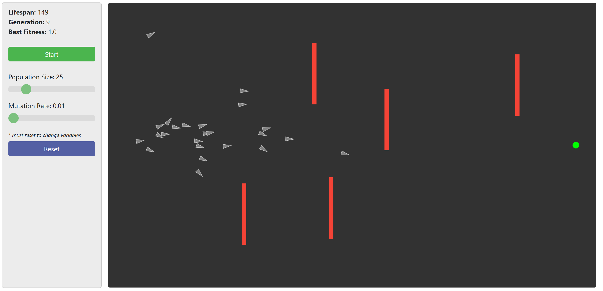

# Genetic Algorithm Target Seeking

This project utilizes a genetic algorithm to find an optimal path to a target through a maze of obstacles utilizing a population of "rockets".

The user has control over the population size, mutation rate and can place obstacles between the starting point and the target.

Created with the help of the p5.js drawing library (https://p5js.org/)
